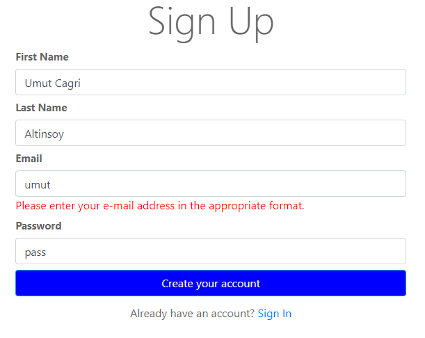
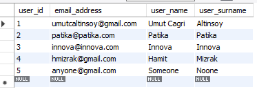
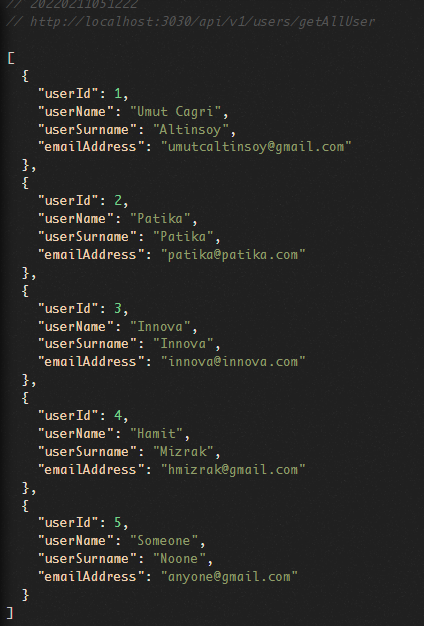
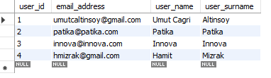

# Innova&Patika Java Spring Bootcamp - Week 5

## Tech Stack
* Java 11
* Spring Boot DevTools
* Lombok
* Spring Configuration Processor
* Spring Web
* Thymeleaf
* Spring Data JPA
* H2 Database
* MySQL Driver
* Validation
* Spring Boot Actuator
* HTML, CSS, Bootstrap

### LogIn

### User Registration Validation Page

### User Registration Validation Page / EmailError

### After Registration Database Records

### Request-1

### Request-2

### Request-3 > After delete user by id 

### After Deletion Database Records


### Dependencies
```
<dependencies>
        <dependency>
            <groupId>org.springframework.boot</groupId>
            <artifactId>spring-boot-starter-actuator</artifactId>
        </dependency>
        <dependency>
            <groupId>org.springframework.boot</groupId>
            <artifactId>spring-boot-starter-data-jpa</artifactId>
        </dependency>

        <dependency>
            <groupId>org.springframework.boot</groupId>
            <artifactId>spring-boot-starter-thymeleaf</artifactId>
        </dependency>
        <dependency>
            <groupId>org.springframework.boot</groupId>
            <artifactId>spring-boot-starter-validation</artifactId>
        </dependency>
        <dependency>
            <groupId>org.springframework.boot</groupId>
            <artifactId>spring-boot-starter-web</artifactId>
        </dependency>

        <dependency>
            <groupId>org.springframework.boot</groupId>
            <artifactId>spring-boot-devtools</artifactId>
            <scope>runtime</scope>
            <optional>true</optional>
        </dependency>

<!--        <dependency>-->
<!--            <groupId>com.h2database</groupId>-->
<!--            <artifactId>h2</artifactId>-->
<!--            <scope>runtime</scope>-->
<!--        </dependency>-->
        
        <dependency>
            <groupId>mysql</groupId>
            <artifactId>mysql-connector-java</artifactId>
            <scope>runtime</scope>
        </dependency>
        <dependency>
            <groupId>org.springframework.boot</groupId>
            <artifactId>spring-boot-configuration-processor</artifactId>
            <optional>true</optional>
        </dependency>
        <dependency>
            <groupId>org.projectlombok</groupId>
            <artifactId>lombok</artifactId>
            <optional>true</optional>
        </dependency>
        <dependency>
            <groupId>org.springframework.boot</groupId>
            <artifactId>spring-boot-starter-test</artifactId>
            <scope>test</scope>
        </dependency>
    </dependencies>

```

* [Github](https://github.com/umutcaltinsoy/SpringMvcRegistration)


